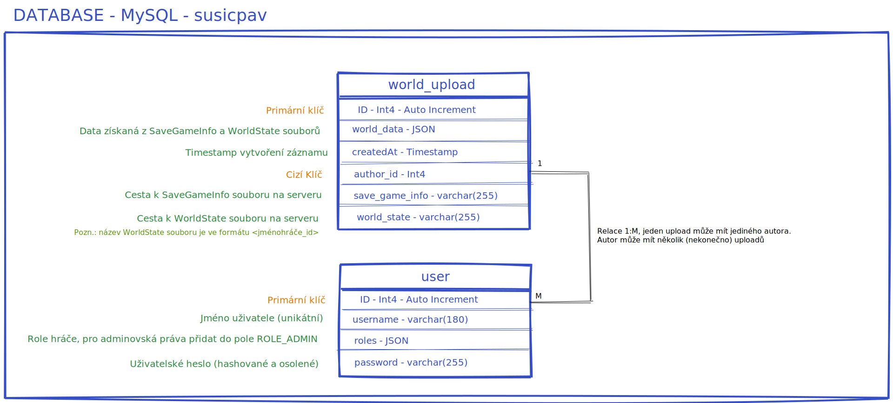
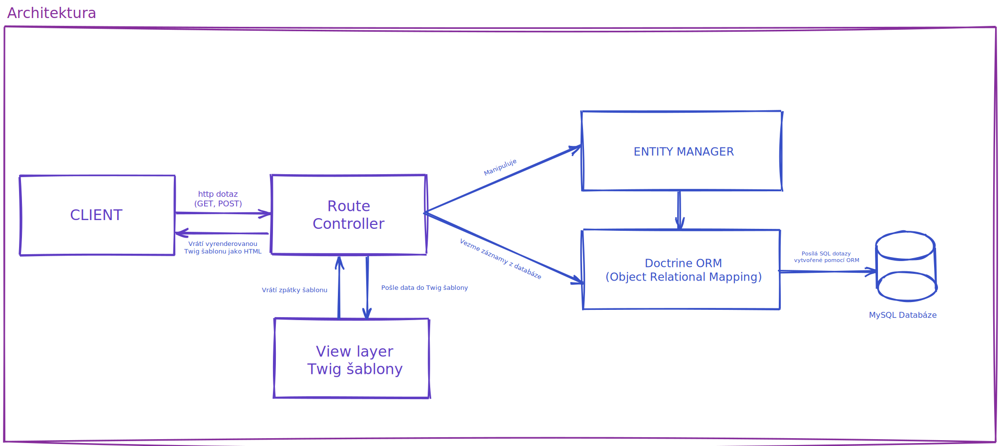
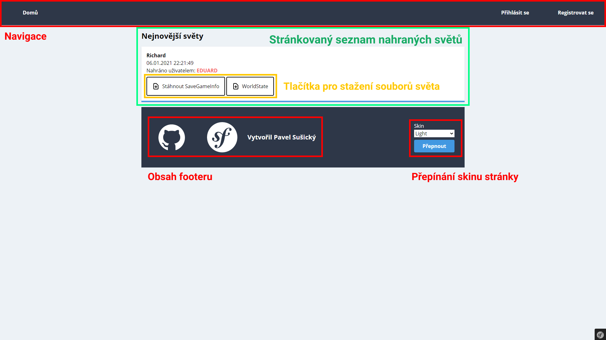
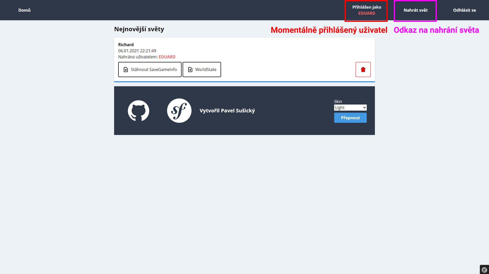
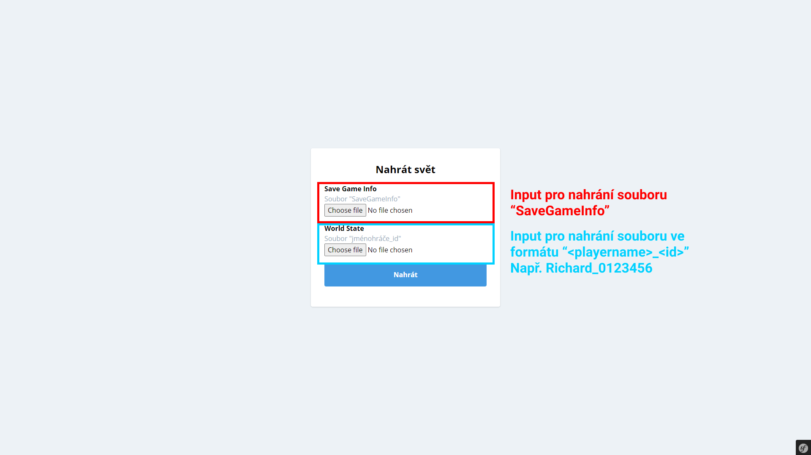

# ZWA Semestrální práce

## 0. Zadání

Zakázkou je vytvoření webu (dále jen "web"), který zobrazí list nahraných herních světů ze Stardew Valley. Nahrané soubory herního světa
se zpracují a přečtou se z nich různé parametry (pro začátek bude stačit jméno hráče, počet peněz), zároveň tento nahraný svět je možný
stáhnout ostatními uživateli, aby si ho mohli zahrát.

Pro nahrání herního světa na web bude potřeba registrace a přihlašování uživatelů, když bude uživatel označen jako "admin", měl by mít možnost mazat kterýkoliv 
nahraný svět. Pro normální uživatele bude možnost jenom mazat svůj vlastní herní svět.

Pro pohodlí uživatelů bude možnost měnit vzhled stránky (minimálně barvy na světlý/tmavý režim).

Souhrn akceptačních podmínek:
- Registrace a přihlašování uživatelů
- Nahrávání a mazání nahrávek
- Světlý a tmavý režim
- Navigace pro směrování na jednotlivé stránky webu

## 1. Tech stack
- PHP 7
- Symfony 5
- PostgreSQL 13

## 2. Lokální instalace

### 2.1 Předpoklady

- Composer (php package manager)
- Yarn (node package manager)
- PHP 7+
- Node.js
- Symfony development kit

### 2.1 Instalace

- Nainstalování PHP dependecies pomocí composeru
- Nainstalování Node dependencies pomocí yarnu
- Nastavení environment variables (.env) pro PostgreSQL/MySQL dabázi

## 3. Diagramy

## 4. Popis Zabezpečení

- Uživatelská hesla jsou zahashovaná a osolená
- Všechny formuláře používají unikátní tokeny, pro zamezení CSRF útoku.
- Všechny uživatelské vstupy zobrazeny na výstupu jsou převedeny do HTML entities (řešeno automaticky ze strany Twig šablon) zabraňující XSS útokům.

## 5. Zpracování uploadování

- Pro parsování XML souborů hry používám DomCrawler knihovnu z composeru
- K DomCrawleru ještě používám knihovnu css-selector pro použití css-like selektorů místo XPath

## 6. Popis použití Symfony frameworku
- Projekt je založen na kostře typické Symfony aplikace používající MVC architekturu.

viz diagram architektury v **4. Diagramy**

## 7. Manuál

Pro nahrávání herních světů se je třeba přihlásit na `/login` stránce, nebo se registrovat na `/register`. Poté lze svět nahrávat na
`/world/upload`. Všechny zmíněné odkazy jsou dostupné přes navigaci webu.

Mazání herních světů je možné z listu na úvodní stránce, když máte pravomoc mazat nahrání objeví se u něho červené tlačítko koše. Admin má možnost mazat všechny nahrání.

## 8. Okomentované UI

;
;
;

## 9. CSS

CSS v tomto projektu je vytvořeno pomocí knihovny TailwindCSS. Tailwind je soubor tzv. "utility" tříd, pomocí kterých lze komponovat jednotlivé prvky stránky až po layout.

Protože jsem použil Tailwind pro tento projekt, tak jsem nenapsal ani jednu čárku CSS, pouze používal tailwind třídy v rámci .twig templatů. Např. "flex items-center justify-center", což nastaví display: flex, align-items: center, justify-content: center vlastnosti danému elementu.
